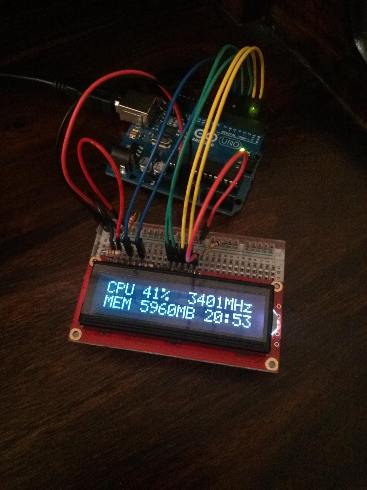

CPU Status Display
==================

This repository contains a Python script which gathers data and sends it to a connected [Arduino](http://arduino.cc/en/Main/arduinoBoardUno) which then displays the data on a [16x2 LCD display](https://www.sparkfun.com/products/709). I am using it to display information about my computer but it could easily be adapted to display any text based information gatherable from python, for instance the weather, share prices or whether you have unread emails.

The Arduino sketch receives data from the PC over serial and then prints it to the screen. Each line of text *begins* with a newline character and then a single one of `T`,`B`,`U`,`D` specifying which line is to be updated
 * `T` - update the top line.
 * `B` - update the bottom line.
 * `D` - move the top line down and then replace the top line (i.e. scroll up)
 * `U` - move the bottom line up and then replace the bottom line (i.e. scroll down)
 
If a line is too long to fit in 16 characters the line will scroll slowly to the left to display all characters eventually looping round to the beginning again. The sketch is controlled by several parameters which can be changed from within the code; scroll speed for long lines, refresh rate, timeout interval and maximum line length.
 
The corresponding Python script uses the `pywin32` and `wmi` modules to gather information from Windows about the CPU usage, etc. It then formats the data into a string and sends it to the Arduino where it is displayed. By default the script uses serial connection `COM 3`. It is possible to display the CPU temperature if supported by the computer's motherboard (unfortunately I couldn't get this to work but for information see [here](http://stackoverflow.com/questions/10776802/which-python-module-is-used-to-read-cpu-temperature-and-processor-fan-speed-in-w)).
 
The Python script is also wrapped as a Windows service meaning the display will have the information as soon as the computer has booted to the logon screen. To install the service run `cmd.exe` as an administrator, change to the directory where the script is and run `python serial_print.py install`. After this the service will appear in the list of windows services (Computer > Manage > Services) where it can be set to start automatically at startup.